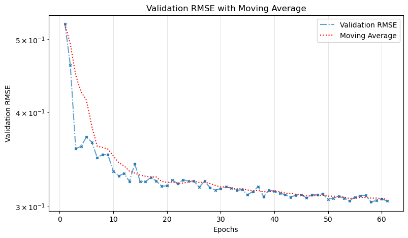

# pix2pix

Nesse repositório, é explorado como GANs podem ser usadas para resolver a tarefa de tradução imagem para imagem. Em particular, temos o objetivo de transferir estilos entre imagens.

  

## Implementação

A rede implementada é uma versão da rede pix2pix bastante semelhante com a [rede original](https://phillipi.github.io/pix2pix/).

A arquitetura do gerador segue a estrutura U-Net, que utiliza camadas convolucionais com skip connections para capturar tanto detalhes locais quanto globais. As camadas CK e CDK são responsáveis por construir a rede, onde CK representa camadas convolucionais com normalização e ativação LeakyReLU, enquanto CDK inclui dropout e ativação ReLU para as camadas de upsampling.

O discriminador é baseado na PatchGAN, onde pequenas regiões da imagem são discriminadas em vez da imagem inteira. Isso ajuda a avaliar a autenticidade das características locais da imagem gerada. A rede é construída com camadas convolucionais CK para reduzir a dimensão da imagem e produzir um mapa de probabilidade indicando se cada patch é real ou falso.

## Resultados

  

---
Como podemos ver no gráfico abaixo, treinando por mais tempo, é possível melhorar ainda mais a geração de imagens:

  

## Agradecimentos

Dataset retirado de: https://github.com/Sxela/face2comics.
Teoria aprendida em: https://deep-ufmg.github.io/
